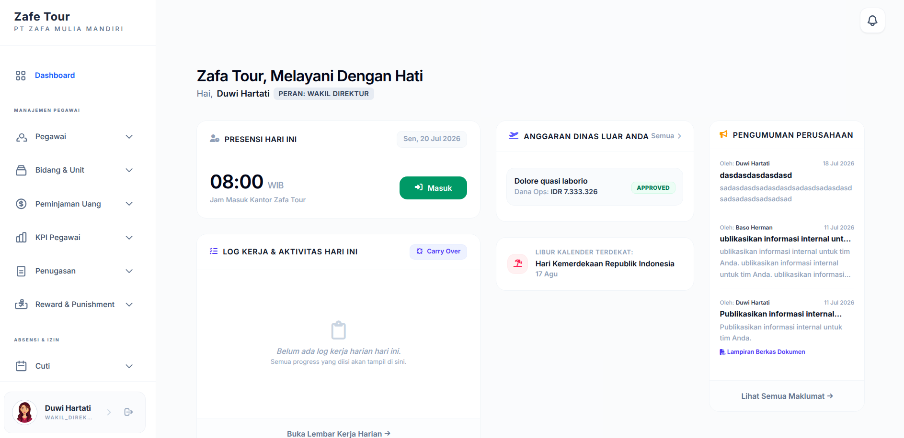
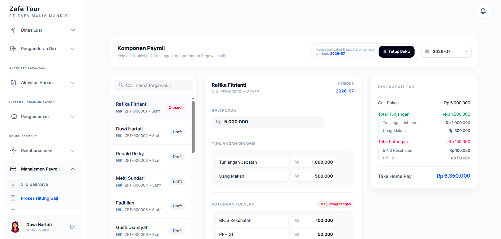
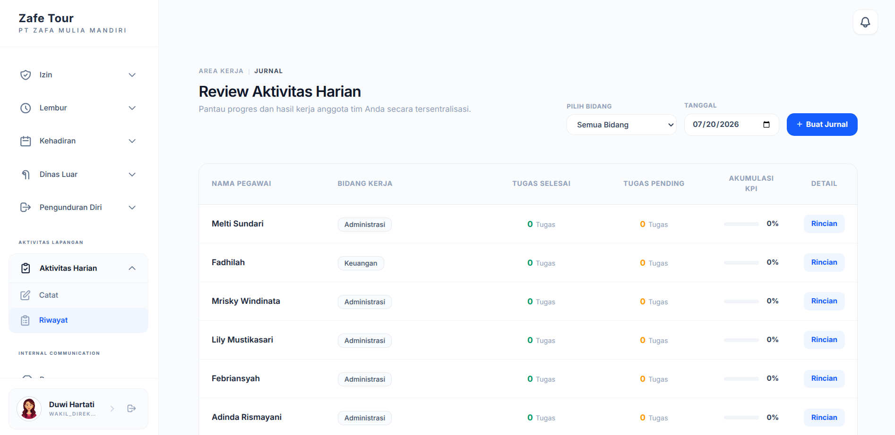
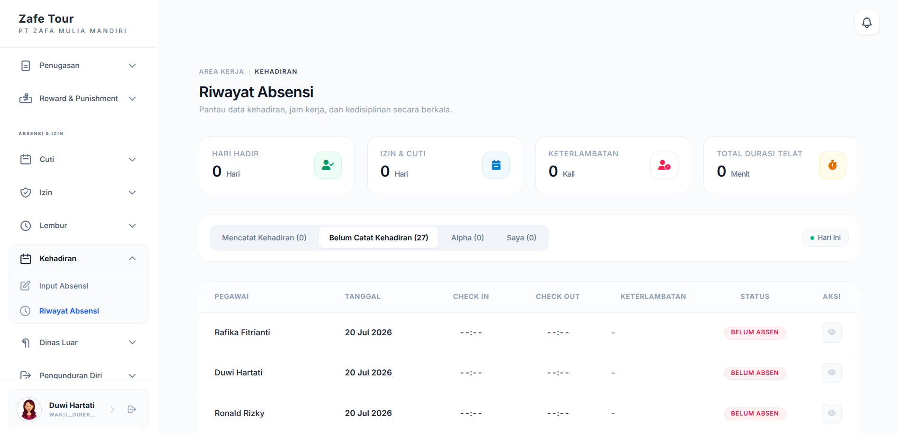
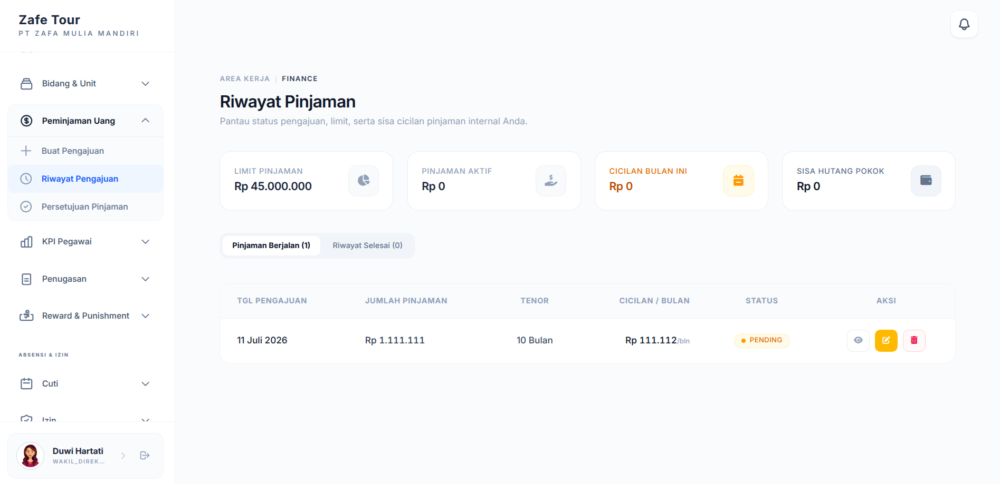

# SIMPEG - Sistem Informasi Kepegawaian

Sistem Informasi Kepegawaian (SIMPEG) adalah aplikasi berbasis web untuk membantu digitalisasi administrasi kepegawaian perusahaan. Sistem menyediakan pengelolaan data pegawai, kehadiran, cuti, lembur, dinas luar, hingga workflow persetujuan bertingkat (_multi-level approval_).

Proyek ini dikembangkan sebagai bagian dari tugas akhir dengan fokus pada arsitektur backend modular menggunakan Node.js, Express.js, MongoDB, dan Redis.

---

# Preview

## Dashboard



## Payroll



## Riwayat Daily Log



## Riwayat Kehadiran



## Riwayat Peminjaman Uang



---

# Fitur

- Authentication berbasis Session
- Role-Based Access Control (RBAC)
- Manajemen Data Pegawai
- Manajemen Kehadiran
- Pengajuan Cuti
- Pengajuan Lembur
- Pengajuan Dinas Luar
- Multi-Level Approval Workflow
- Dashboard
- Notification
- Reporting
- Payroll _(Development)_
- Reward & Punishment _(Development)_

---

# Tech Stack

| Layer           | Technology             |
| --------------- | ---------------------- |
| Backend         | Node.js, Express.js    |
| Database        | MongoDB                |
| ODM             | Mongoose               |
| Cache           | Redis                  |
| Template Engine | EJS                    |
| CSS             | Tailwind CSS           |
| Authentication  | Session Authentication |
| Authorization   | RBAC                   |

---

# Project Structure

```text
src/
├── config/
├── controllers/
├── middleware/
├── models/
├── routes/
├── services/
├── utils/
├── views/
├── app.js
└── server.js
```

---

# Instalasi

## Clone Repository

```bash
git clone https://github.com/mseptiawan/hris-zafa.git

cd hris-zafa
```

## Install Dependency

```bash
npm install
```

## Seed Database

Seeder digunakan untuk membuat data awal seperti akun, role, divisi, jabatan, dan data pendukung lainnya.

```bash
npm run seed
```

## Konfigurasi Environment

Buat file `.env`

```env
PORT=3000

MONGODB_URI=mongodb://localhost:27017/hris_zafa_tour

REDIS_URL=redis://localhost:6379

SESSION_SECRET=your_session_secret

NODE_ENV=development
```

## Jalankan Redis

Linux/macOS

```bash
redis-server
```

atau menggunakan Docker

```bash
docker run -d \
  --name redis \
  -p 6379:6379 \
  redis:7
```

## Jalankan Aplikasi

Development

```bash
npm run dev
```

Production

```bash
npm start
```

Aplikasi akan berjalan di

```
http://localhost:3000
```

---

# Arsitektur

```text
Client
   │
   ▼
Express Routes
   │
   ▼
Controllers
   │
   ▼
Services
   │
   ▼
Models
   │
   ▼
MongoDB

Redis
├── Session Store
└── Cache
```

---

# Author

**M. Septiawan**

- GitHub: https://github.com/mseptiawan
- LinkedIn: https://www.linkedin.com/in/mseptiawan/
- Email: mseptiawan017@gmail.com

---

# License

Proyek ini dikembangkan untuk tujuan akademik sebagai bagian dari penelitian tugas akhir.
